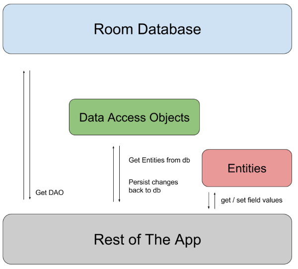

# Room Persistence Library 

Room is a persistence library, part of the Android Architecture Components. It makes it easier to work with SQLiteDatabase objects in your app, decreasing the amount of boilerplate code and verifying SQL queries at compile time.

Room is built to work with LiveData and RxJava for data observation.


<p align="center">
  
</p>


#### Room has three main components of Room DB :

1. Entity
2. Dao (Data Access Object)
3. Database


##### Entity 

Represents a table within the database.

Entities annotations

1. @Entity —>  Every model class with this annotation will have a mapping table in DB.

2. @PrimaryKey —>  As its name indicates, this annotation points the primary key of the entity. 
   autoGenerate — if set to true, then SQLite will be generating a unique id for the column
   
3. @ColumnInfo — allows specifying custom information about column   

4. @Ignore — Field will not be persisted by Room

5. @Embeded — Nested fields can be referenced directly in the SQL queries.


##### Dao

DAOs are responsible for defining the methods that access the database.

##### Database 

It is the main class that’s annotated with @Database should satisfy the following conditions:

Be an abstract class that extends RoomDatabase.

1. Include the list of entities associated with the database within the annotation.

2. Contain an abstract method that has 0 arguments and returns the class that is annotated with @Dao.

3. At runtime, you can acquire an instance of Database by calling Room.databaseBuilder() or Room.inMemoryDatabaseBuilder().


##### Step 1 : Add dependencies 


```java

apply plugin: 'kotlin-kapt'

dependencies {
  def room_version = "2.2.5"

  implementation "androidx.room:room-runtime:$room_version"
  kapt "androidx.room:room-compiler:$room_version"

  // optional - Kotlin Extensions and Coroutines support for Room
  implementation "androidx.room:room-ktx:$room_version"

  // optional - Test helpers
  testImplementation "androidx.room:room-testing:$room_version"
  
   // Coroutines  
    implementation 'org.jetbrains.kotlinx:kotlinx-coroutines-core:1.3.7'
    implementation 'org.jetbrains.kotlinx:kotlinx-coroutines-android:1.3.6'
    implementation "org.jetbrains.kotlinx:kotlinx-coroutines-rx2:1.3.2"
  
 
}

```

##### Step 2 : Create the Model class that is our Entity 

```java
@Entity
data class Student(
    @PrimaryKey(autoGenerate = true) @ColumnInfo(name = "id") val id: Int,
    @ColumnInfo(name = "firstName") var firstName: String,
    @ColumnInfo(name = "lastName") var lastName: String,
    @ColumnInfo(name = "dob") var dob: Date,
    @ColumnInfo(name = "address") var address: String
)
```

##### Step 3 : Create the DAO 

```java

@Dao
interface DaoStudent {

    @Query("SELECT * FROM Student")
    fun loadAll(): List<Student>

    @Delete
    fun deleteStudent(student: Student)

    @Query("SELECT * from Student where firstName==:name")
    fun getStudentListByName(name: String): List<Student>

    @Insert
    fun insertStudent(student: Student)

}


```

##### Step 4 : Create the database  

```java

Database(entities = [Student::class], version = 2)
@TypeConverters(DateConverter::class)
abstract class StudentDataBase : RoomDatabase() {


    abstract fun getStudentDao(): DaoStudent


    companion object {
        var INSTANCE: StudentDataBase? = null
       

        fun getStudentDataBase(context: Context): StudentDataBase? {
            if (INSTANCE == null) {
                INSTANCE = Room.databaseBuilder(
                    context.applicationContext,
                    StudentDataBase::class.java,
                    "studentDb"
                )
                    .build()
            }
            return INSTANCE
        }

        fun cleanDbObject() {
            INSTANCE = null
        }

    }
}

```

##### Step 4 : How to perform Insert , Retrive , and Delete Operation 

```java

GlobalScope.launch {

            var student = Student(4, "abhishek", "modi", date,"Indore")
            instant.getStudentDao().insertStudent(student)

            var list = instant.getStudentDao().loadAll()

            Log.e("Student", "$list")
        }

```

    
